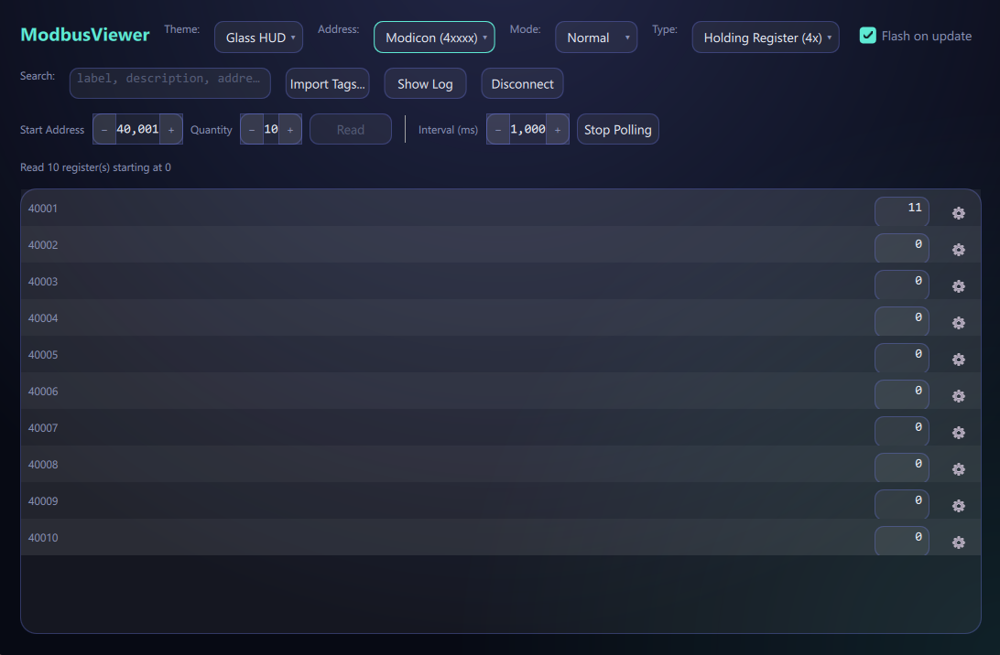
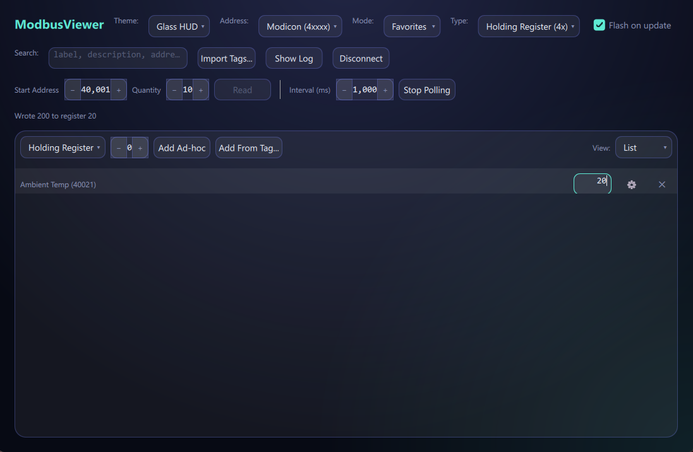
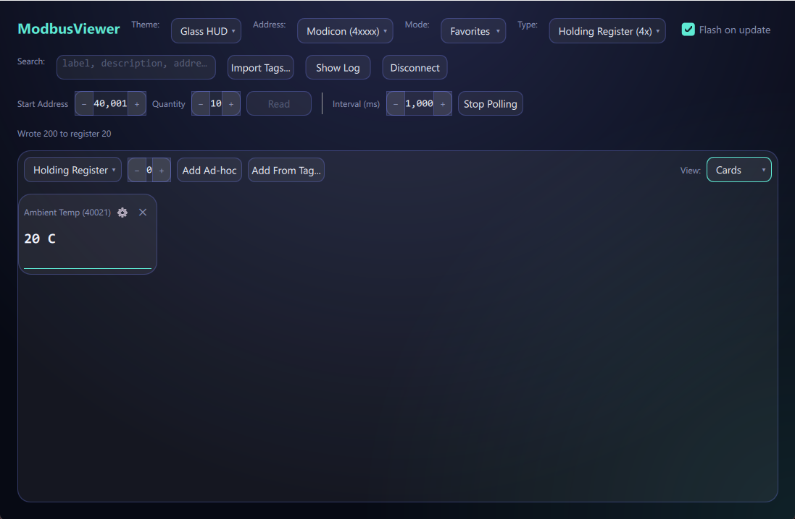

# ModbusViewer

A cross-platform (Windows + macOS) Modbus TCP/RTU master tool — a Qt6/QML clone of
Modbus Poll, built with C++20 and CMake.

## Screenshots

Two full visual themes ship with the app — Glass HUD and Signal Console — switchable
live from a picker on every screen, no restart required.

### Normal mode — live register polling



Point it at a contiguous block of registers and watch them update in place as they
poll — no manual re-reads, no guessing whether a value is current. Every field shows
exactly what it needs to and nothing more: address, live value, a one-click format
editor. Switch addressing convention (0-based PDU or Modicon 4xxxx) or register type
mid-session without losing your place.

### Favorites — List view



Most sessions don't need every register in a device — they need the five that
actually matter. Favorites lets you hand-pick registers (ad hoc by address, or
straight from an imported tag database) into one focused, always-current list,
independent of whatever range Normal mode happens to be reading. Writes confirm
immediately — the status line above shows exactly what was written and where.

### Favorites — Cards view



The same curated list, laid out as stat cards with a rolling sparkline per value —
built for watching a handful of registers trend over time at a glance, not just
reading a single instantaneous number. One toggle switches between List and Cards;
nothing about your Favorites selection changes underneath it.

### Tag-driven workflows

"Import Tags..." loads a CSV or JSON register map — real labels and descriptions
("Ambient Temp," not "register 40021") instead of bare addresses, ready to drop into
Favorites via "Add From Tag..." Combined with live search/filter across label,
description, address, and unit, a large register map stays navigable instead of
turning into a wall of numbers.

That combination — one tool for a full contiguous sweep *and* a focused live watch
list, both addressable by name instead of memorized offsets, in a theme you'd
actually want to stare at during a long debugging session — is the whole premise:
industrial-tool capability without the industrial-tool interface.

## Features

- **Modbus TCP and RTU (serial)** master, with a connection screen for both transport
  types (host/port for TCP; port/baud/data bits/parity/stop bits for RTU).
- **Live polling** of a contiguous register range (Normal view) or a hand-picked list
  of registers (Favorites view) — exactly one poll loop active at a time, retargeted
  live when you switch modes.
- **Read coalescing**: nearby targets are merged into the fewest possible read
  requests rather than one request per register.
- **Register writes** (function code 06) with immediate re-read to confirm.
- **Value formatting** per register: Signed/Unsigned Decimal, Hex, Binary, Float32,
  Int32 (Signed/Unsigned), with configurable byte order, scale, offset, and unit —
  editable per-row from a format picker.
- **Addressing convention toggle**: 0-based (PDU) or Modicon (4xxxx) style addresses,
  applied consistently across every address field.
- **Tag database import** from CSV or JSON, driving the Favorites picker and giving
  registers real labels/descriptions instead of bare addresses.
- **Search/filter** across label, description, address, and unit, live across both
  Normal and Favorites views.
- **Communication log panel** showing raw Tx/Rx frames and errors.
- **Auto-reconnect** with a "connection lost" state that keeps last-known values on
  screen (visually marked stale) rather than clearing them.
- **Error/stale-value indication** per cell when a poll target starts failing.

## Requirements

- Qt 6.5 or newer (developed against 6.11.1)
- CMake 3.21+
- A C++20 compiler — developed with Qt's bundled MinGW 13.1.0 on Windows; any
  C++20-capable compiler with the required Qt modules should work
- Qt modules: `Core Gui Qml Quick QuickControls2 QuickDialogs2 Network SerialPort Test`

## Building

```bash
cmake -S . -B build -DCMAKE_PREFIX_PATH="/path/to/Qt/6.11.1/<kit>" -DCMAKE_BUILD_TYPE=Debug
cmake --build build
```

On Windows with Qt's bundled MinGW kit:

```powershell
$env:Path = "C:\Qt\Tools\mingw1310_64\bin;C:\Qt\Tools\Ninja;C:\Qt\6.11.1\mingw_64\bin;" + $env:Path
cmake -S . -B build -G Ninja -DCMAKE_PREFIX_PATH="C:/Qt/6.11.1/mingw_64" -DCMAKE_BUILD_TYPE=Debug
cmake --build build
```

The executable lands at `build/ModbusViewer.exe` (or `build/ModbusViewer` on
macOS/Linux). To run it, only the Qt runtime libraries need to be on the loader
path — not the full build toolchain.

## Running the tests

```bash
cd build
ctest --output-on-failure
```

Tests are Qt Test-based and use a `FakeTransport` test double for protocol-layer
coverage (no real socket/serial I/O needed), plus a real loopback `QTcpServer` for
TCP connection-lifecycle coverage. RTU end-to-end coverage is similarly
`FakeTransport`-based; the one thing that can't be faked is a real serial link,
which this project has not yet been tested against.

## Dev-time simulator

`tools/pymodbus_simulator.py` is a Modbus TCP/RTU slave simulator for exercising the
app without real hardware, pinned to `pymodbus==3.7.4` (see `tools/requirements.txt`).

```bash
pip install -r tools/requirements.txt
python tools/pymodbus_simulator.py --mode tcp --port 502
```

## Project status

v1 milestones (M1 through M8 — protocol codec, TCP/RTU transports, polling engine
with read coalescing and auto-reconnect, value formatting, tag database, Favorites,
search, communication log, and packaging) are complete. See
[`PROGRESS.md`](PROGRESS.md) for exactly where things stand and
[`docs/roadmap.md`](docs/roadmap.md) for what's planned post-v1. Architecture and
design-decision rationale live in [`docs/`](docs/), organized by topic
(`architecture.md`, `protocol.md`, `performance.md`, `favorites-search-tags.md`,
`connection-ux.md`, `coding-standards.md`).

## Contributing

See [`CONTRIBUTING.md`](CONTRIBUTING.md).

## License

MIT — see [`LICENSE`](LICENSE).
